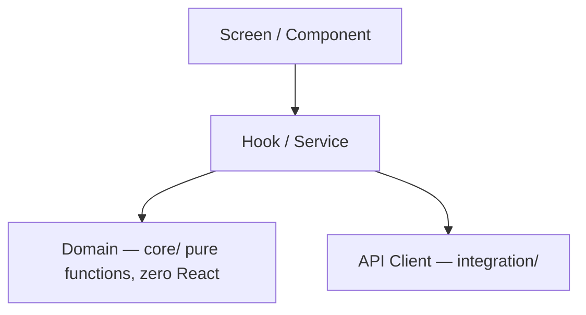

# Borrowise

> **See your loans clearly. Borrow wisely.**

A loan intelligence toolkit for iOS (Android to follow): amortization schedules,
early-payoff and refinance break-even math, and live U.S. market-rate context — so you
can see exactly where your rate sits versus the market before you sign.

Borrowise is **not** a lender and **not** an advisor. It is an education and simulation tool.

> ⚠️ **Educational and informational purposes only — not financial advice.**
> Borrowise does not originate, broker, or recommend loans. Always consult a qualified
> professional before making borrowing decisions.

<!-- Demo GIF slot — added with the first UI commit (see docs/media/). -->
<!--  -->

---

<!-- Badges go live as the pipeline lands: CI + coverage (commit #6), release (commit #29). -->

---

## Why Borrowise

No one should sign a loan they don't understand. Most calculators stop at a monthly
payment; Borrowise shows the full amortization story, the true cost of borrowing, and how
your rate compares to real U.S. market benchmarks. It is built in public, test-first, and
open source — a working reference for a modern React Native + native-Swift codebase.

## Features (roadmap)

- [ ] **US-01** First-launch onboarding + not-financial-advice disclosure + local profile
- [ ] **US-02** Add a loan → instant monthly payment & total interest (offline, pure core)
- [ ] **US-03** Amortization schedule (table + chart, extra-payment scenarios)
- [ ] **US-04** Market-rate dashboard (U.S. Treasury FiscalData — no-auth API)
- [ ] **US-05** Benchmark comparison vs your APR (FRED — apiKey API)
- [ ] **US-06** Refinance break-even calculator
- [ ] **US-07** Sign-in & sync (Google OAuth 2.0 + PKCE; Drive appDataFolder backup)
- [ ] **US-08** Home-screen widget (Swift / SwiftUI + WidgetKit)
- [ ] **US-09** Rate alerts (Borrowise Pro)
- [ ] **US-10** Deep linking (`borrowise://calc?…`)
- [ ] **US-11** Export schedule as CSV / PDF (Borrowise Pro)
- [ ] **US-12** Accessibility & dark mode (VoiceOver, Dynamic Type)
- [ ] **US-13** _(stretch)_ Plaid Sandbox liability import
- [ ] **US-14** _(stretch)_ On-device Core ML rate-trend forecast

## Demo media

| Story | Preview |
|-------|---------|
| US-02 Calculator | _media pending_ |
| US-03 Schedule | _media pending_ |
| US-04 Dashboard | _media pending_ |

_Each row is filled with a `docs/media/us-XX-<slug>.gif` as its UI commit lands._

## Architecture

Layering rule: **Screen/Component → Hook(Service) → Domain(core, pure) → API Client(integration)**.
`core/` has no React dependencies, so unit tests run in milliseconds. Full detail in the ADRs.

## API Security (three auth models)

Borrowise deliberately integrates one API at each rung of the auth spectrum:

| Tier | API | Auth model | Secret handling |
|------|-----|------------|-----------------|
| No auth | U.S. Treasury FiscalData | none (public) | — |
| API key | FRED (Federal Reserve) | static API key | `.env` + EAS secrets; never committed |
| OAuth 2.0 | Google | Authorization Code + PKCE | tokens in Keychain / SecureStore |

Native mobile clients use **PKCE with no client secret**; tokens never touch JS state or logs.
(GitHub OAuth Apps are excluded — they support device flow only, not mobile PKCE.)

## Testing

Test-first, always. Coverage gates: **`core/` ≥ 90%**, **overall ≥ 80%**.

- **Jest + React Native Testing Library** — unit & component
- **Maestro** — end-to-end
- **XCTest** — the Swift native module & widget

CI retries flaky tests in isolation before failing the build.

## Getting Started

_Coming with the Expo scaffold (commit #2)._

## Architecture Decision Records

- [ADR-0001 — Record architecture decisions](docs/adr/0001-record-architecture-decisions.md)
- [ADR-0002 — Expo React Native with a Swift native module](docs/adr/0002-expo-react-native-with-swift-native-module.md)

## Built in public

Borrowise is developed commit-by-commit in the open, test-first, with an atomic
Conventional-Commits history. Follow along — issues and PRs welcome.

## License

[MIT](LICENSE) © 2026 Bonmyeong Koo

---

> ⚠️ **Educational and informational purposes only — not financial advice.**
